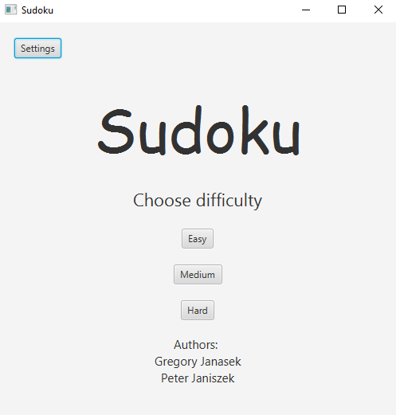
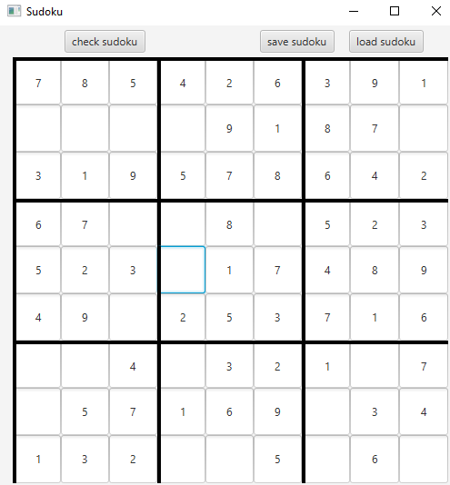

# Sudoku
Simple sudoku game created as part of Component Programming course in Lodz University of Technology.

## Table of contents
- [General information](#general-information)
- [Technologies](#technologies)
- [Screenshots](#screenshots)
- [Setup](#setup)
- [Acknowledgements](#acknowledgements)

## General information

Project was aimed to help students better understand and put in practice core concepts from the course such as:
- Backtracking algorithm
- Dependency Injection
- Listener design pattern
- Serialization and Data Access Object pattern
- Factory design pattern
- Repository design pattern
- Overriding hashCode(), equals(), compareTo() and toString() methods
- Layered architecture
- JavaFX
- Bidirectional binding
- Exception chaining
- Utilising loggers
- Internationalization and resource bundles
- JDBC and transactions processing

## Technologies
- Java JDK 17
- Apache Maven 3.9.4
- Apache Derby 10.14.2.0
- JavaFX 17.0.6

## Screenshots

## Setup
To launch this project:
1. Download Java JDK 17 from: https://www.oracle.com/pl/java/technologies/downloads/
2. Make sure you have a corresponding Maven version installed, you can download it from here:https://maven.apache.org/download.cgi
3. After cloning this repository, install all dependencies and build project by executing:
~~~~
$ mvn build 
~~~~

## Acknowledgements
Authors:
- Grzegorz Janasek
- Piotr Janiszek 

Many thanks to Lodz University of Technology for such an amazing course.

